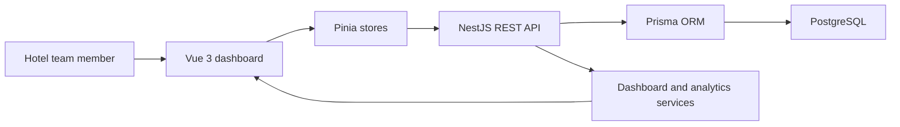
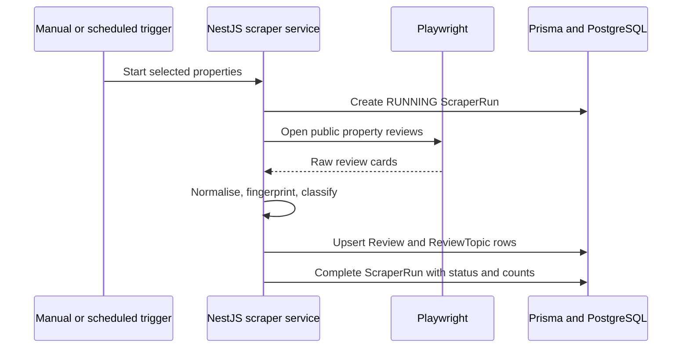

# Azzurro Review Insights — Project Overview

Last updated: 28 July 2026

## 1. Purpose

Azzurro Review Insights is an operations dashboard for hotel teams. It turns
guest reviews into a clear view of:

- overall rating and review volume;
- positive, neutral, and negative sentiment;
- recurring topics such as cleanliness, breakfast, location, and staff;
- changes over time and differences between hotels;
- individual reviews that need attention.

The current dataset is synthetic and is labelled as demonstration data in the
interface. It allows every dashboard feature to be tested without presenting
sample records as genuine Booking.com reviews.

## 2. Current delivery status

| Area | Status | Notes |
| --- | --- | --- |
| Vue application shell | Complete | Responsive sidebar, routes, user-friendly copy, SEO metadata, and mobile layouts |
| Dashboard experience | Complete | Live KPIs, Chart.js charts, property/date filters, skeletons, empty states, and errors |
| Review feed | Complete | Search, hotel, sentiment, topic, rating, date, sort, pagination, reset, and CSV download |
| NestJS API | Complete | Validated REST endpoints for properties, reviews, dashboard, analytics, and insights |
| PostgreSQL and Prisma | Complete | UUIDv7 schema, migrations, constraints, indexes, seed data, and shared Prisma client |
| Verification | Complete for the current build | Production builds, Prisma checks, and live API/filter checks are used; automated test-case files are intentionally excluded |
| Live text classification | Complete | Collected records use rating sentiment and explainable multi-topic phrase rules |
| Booking.com collection | Implemented, awaiting live verification | Bounded Playwright extraction, persistence, safe-stop behaviour, CLI, APIs, and run history are connected |
| Public deployment | Pending | The Vue app and NestJS API must be deployed together with a managed PostgreSQL database |

Detailed future work is maintained in
[`remaining-work.md`](./remaining-work.md). The original assessment is mapped
requirement by requirement in
[`assessment-status.md`](./assessment-status.md).

## 3. Architecture



The Vue application never connects directly to the database. Components update
Pinia stores, the stores call small Axios API modules, and NestJS validates each
request before Prisma queries PostgreSQL. Keeping these layers separate makes
the interface easier to maintain and prevents database details from leaking
into the browser.

## 4. Technology choices

### Frontend

- Vue 3 for reusable interface components
- Pinia for dashboard and review state
- Vue Router for page navigation and shareable filter URLs
- Chart.js with `vue-chartjs` for rating, sentiment, and topic charts
- Tailwind utilities plus modular SCSS for layout, theme, and responsive states
- DM Sans from Google Fonts for a clean, readable product interface
- Axios for API requests and consistent error handling

### Backend

- NestJS for modular controllers, validation, and services
- Prisma ORM for typed, readable, and parameterised database access
- PostgreSQL for durable relational data and analytics queries
- Swagger at `/api/docs` for interactive API documentation

## 5. How the Prisma models work

All five database models use:

```prisma
id String @id @default(uuid(7)) @db.Uuid
```

Prisma generates a UUID version 7 and PostgreSQL stores it in a native `uuid`
column. UUIDv7 values remain globally unique while being time ordered, which is
friendlier to database indexes than fully random UUIDs.

### Property

One record represents one hotel. Its slug and Booking.com URL are unique. A
property owns many reviews and can have many collection runs. Inactive
properties can be retained for history without appearing in normal selection
lists.

### Review

This is the central guest-feedback record. It stores the hotel, rating, guest
details, positive and negative comments, dates, travel information, source URL,
overall sentiment, and whether the row is synthetic.

Two unique constraints prevent duplicate ingestion:

- `(propertyId, externalReviewId)` when the source provides a stable ID;
- `(propertyId, fingerprint)` when the application must identify the review
  from a SHA-256 content fingerprint.

Indexes support the most frequent operations: hotel/date feeds, latest reviews,
sentiment trends, and rating filters.

### Topic

A topic is a reusable operational category such as `cleanliness` or
`staff-service`. The stable `key` is used by the API, while `displayName` is
shown to users. Topics can be deactivated without deleting historical results.

### ReviewTopic

This join model creates the many-to-many relationship between reviews and
topics. One review can mention several topics, and each topic can occur in many
reviews. The row also records topic-level sentiment, classifier confidence, and
the matching text used as evidence.

The unique `(reviewId, topicId)` constraint ensures a review receives a topic
only once. Deleting a review removes its topic links, while deleting a topic in
use is restricted to preserve historical meaning.

### ScraperRun

This model is the audit trail for future review collection. It records status,
start/completion times, counts for found, inserted, updated, and skipped
reviews, plus any safe error details. The property relation is optional so a
portfolio-level run can also be recorded.

The collection service now creates and completes these records for CLI and
manual API updates.

## 6. How the models work together during collection

The Prisma models are storage definitions; they do not collect or classify
anything by themselves. NestJS services will use them in this sequence:

1. Read an active `Property` and its public `bookingUrl`.
2. Create a property-specific `ScraperRun` with `RUNNING` status.
3. Extract and normalise public review data.
4. Calculate the review fingerprint and sentiment.
5. Upsert `Review` using the source ID or fingerprint duplicate protections.
6. Match active `Topic` records and write the resulting `ReviewTopic` links.
7. Update the `ScraperRun` counters and finish it as `SUCCESS`, `PARTIAL`, or
   `FAILED`.
8. Dashboard services aggregate the stored `Review` and `ReviewTopic` rows.



The recommended implementation creates one `ScraperRun` per property. This
allows Potts Point to fail while Surry Hills, Central Sydney, and Darling
Harbour still complete successfully.

## 7. Request and filter behaviour

The review screen sends the following validated query parameters to
`GET /api/reviews`:

| Interface control | API parameter |
| --- | --- |
| Search feedback | `search` |
| Hotel | `propertyId` |
| Guest sentiment | `sentiment` |
| Topic | `topic` |
| Rating range | `minRating`, `maxRating` |
| From date | `from` |
| To date | `to` |
| Show first | `sort` |
| Load more | `page`, `limit` |

Filters reset pagination to page one and are reflected in the page URL, so a
filtered view can be refreshed or shared. Search is debounced to avoid sending
a request for every keystroke. Empty values are removed before the request is
sent.

The review service builds one Prisma `where` object, runs the data and count
queries together, and returns bounded pagination metadata. All input passes
through NestJS validation before reaching Prisma.

## 8. Main API routes

All routes begin with `/api`.

| Route | Purpose |
| --- | --- |
| `GET /health` | API and database readiness |
| `GET /properties` | Active hotels |
| `GET /reviews` | Filtered, sorted, paginated review feed |
| `GET /reviews/:id` | One complete review with topics |
| `GET /dashboard/overview` | KPIs and comparable-period results |
| `GET /analytics/property-ratings` | Rating by hotel |
| `GET /analytics/rating-trend` | Daily rating trend |
| `GET /analytics/sentiment-trend` | Daily sentiment counts |
| `GET /analytics/topics` | Topic volume and percentages |
| `GET /insights` | Evidence-backed operational insight statements |

## 9. Local setup

Prerequisites: Node.js, npm, and Docker Desktop.

```bash
docker compose up -d postgres

cd backend
copy .env.example .env
npm install
npx prisma generate
npx prisma migrate deploy
npx prisma db seed
npx playwright install chromium
npm run start:dev
```

In another terminal:

```bash
cd frontend
npm install
npm run dev
```

- Dashboard: `http://localhost:5173`
- API: `http://localhost:3000/api`
- API documentation: `http://localhost:3000/api/docs`

Run a bounded update for all active properties with `npm run scrape` from the
backend directory.

Prisma commands use a space between `prisma` and the subcommand. For example,
use `npx prisma migrate dev`, not `npx prisma:migrate dev`.

## 10. Production considerations

Before a public release:

1. complete a permitted bounded live collection and verify the saved sample;
2. configure production `DATABASE_URL`, `APP_TIMEZONE`, and CORS origins;
3. deploy PostgreSQL and the NestJS API;
4. set the frontend `VITE_API_URL` to the public API;
5. run migrations, backend verification, and a final sensitive-data audit;
6. deploy the frontend and perform manual cross-device acceptance testing.

Automated test-case files are intentionally outside the selected delivery
scope. Production builds, Prisma checks, bounded collection runs, and manual
frontend/API acceptance remain part of final verification.
